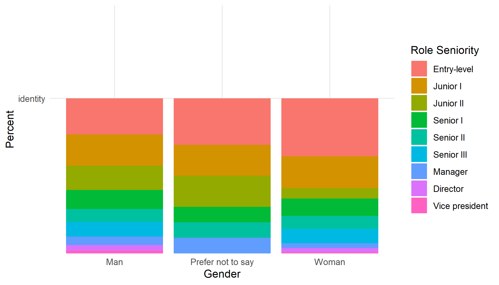
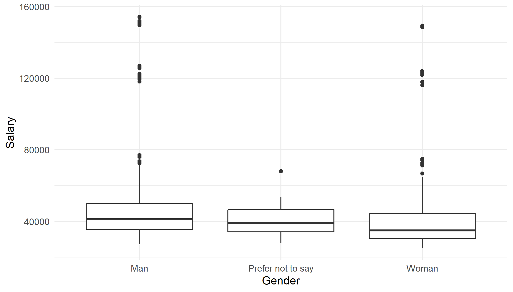
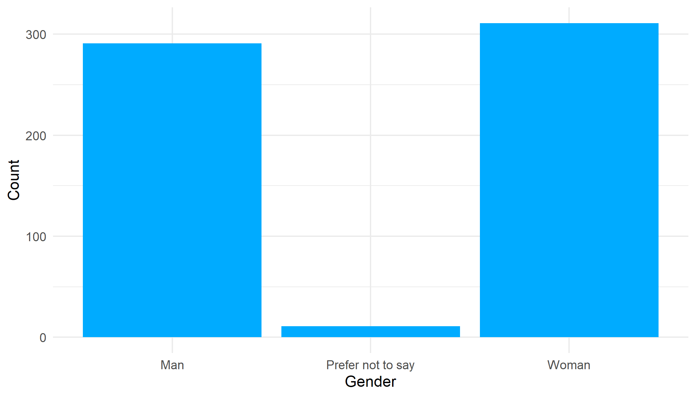
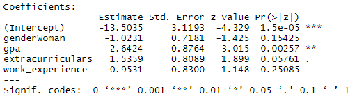
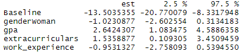
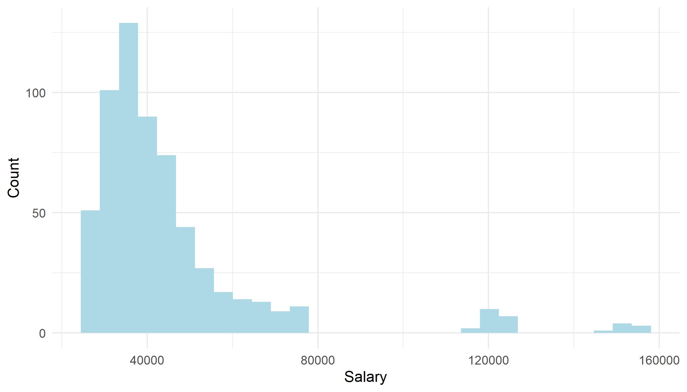

```{r, message = FALSE, echo=FALSE}
library(tidyverse)
library(dplyr)
library(kableExtra)
library(magick)
library(webshot)
# this should supress all code and messages
knitr::opts_chunk$set(include=FALSE)
```

\newpage
# Executive summary

## Background & Aim

The purpose of this study is to explore the possible sources of biases related to Black Saber Software
campus. Given the data received from the company, we will be analyzing whether there is evidence of gender bias in hiring and promotion processes, along with salary in Black Saber Software.

## Key findings

- There is a larger proportion of the male population in leadership roles (Manager and higher)
- Men have a higher median income by about $3000 compared to women
- 51% of applicants to Black Saber Software were women
- Despite this, 70% of final hires were men
- There is no significant evidence that there was gender bias in hiring
- gpa was the most significant predictor for being hired to Black Saber Software

We find a gap in pay and leadership roles in the company. This does not necessarily indicate intentional bias, but should be looked into. There is no evidence of gender bias in the hiring process even though 7/10 hires were men while contributing to 42% of applicants.

## Limitations

- Assigning of arbitrary values on employees (productivity, leadership level)
- Possible external factors keeping holding women back (uncomfortable workplace, lack of other women in team)
- Many forms of bias can manifest that may not necessarily be shown in the data





\newpage
# Technical report


## Introduction

In this report, we will be analyzing whether the hiring, promotion, and salary processes in Black Saber Software are fair on the basis of gender. This will be done by visualizing the salary and proportion of each gender that are in each role seniority. We will create a logistic regression model to predict whether an applicant is hired based on gender and variables such as gpa and work experience.

### Research questions
- Is there a bias towards hiring one gender over the other?
- Is a particular gender more likely to be promoted over the other?
- Is there a difference in salary between men and women?

## There is no significant evidence of gender bias in hiring.
The data we have received will be using to analyze the hiring method is the applicants data which contains 613 rows with variables applicant_id, team_applied_for, cover_letter, cv, gpa, gender, extracurriculars, and work_experience. 
We will first look at the proportion of genders of the applicants.
```{r include=FALSE}
black_saber_current_employees <- read_csv("data/black-saber-current-employees.csv")
clean_employees <- black_saber_current_employees %>% distinct(employee_id, .keep_all = TRUE)

applicants_data <- read_csv("data/phase1-new-grad-applicants-2020.csv")
```

We will create a bar graph to help visualize the proportion of men working in the company compared to women.
```{r echo=FALSE}
gender_graph <- applicants_data %>% ggplot(aes(x = gender)) +
  geom_bar(fill = "#00abff") +
  theme_minimal() +
  labs(x = "Gender", y = "Count")
ggsave("images/gender_proportion.png", width = 7, height = 4)
```

We see that there are a higher proportion of women applying to the company compared to men. The company's applicant distribution consists of 47% men, 51% women, and 2% prefer not to say.

We will add a variable that describes whether or not an applicant is hired with 1 being hired and 0 being rejected. The gender of "Prefer not to say" will now be removed so logistic regression can be done.
```{r}
final_hires <- c(2300,5640,3060,4490,5290,1370,6630,5770,5130,5360)
applicants_data <- applicants_data %>% mutate(hired = ifelse(applicants_data$applicant_id %in% final_hires ,1,0))
applicants_data <- applicants_data %>% filter(gender != "Prefer not to say")
applicants_data$gender <- as.factor (applicants_data$gender)
```

We create a model that predicts an applicant being hired based on gender, gpa, extracurriculars, and work experience.
```{r echo=FALSE}
library(lme4)

hiring_model <- glm(hired ~ gender + gpa + extracurriculars + work_experience, family = binomial(link='logit'), data = applicants_data)
par_table = cbind(est = summary(hiring_model)$coef[,1], confint(hiring_model))
rownames(par_table)[1]='Baseline'
par_table

```


Based on the summary of the model, we see that there is no significant evidence to show that there is hiring bias on the basis of being a woman. The correspoding P value is 0.15, and the confidence interval for being a woman contains 0. Therefore, we cannot make a statement regarding evidence of gender bias in hiring. The P-Value for gpa is 0.02, indicating there is significant evidence that a higher gpa corresponds to a higher chance of being hired.



We get a better idea of the significance of gpa on being hired, and the gender variable having a confidence interval that has 0 contained within it.

## There are more men being promoted to manager positions than women
We will be using current Black Saber Software data containing the variables applicant_id, gender, team, financial_q, role_seniority, leadership_for_level, productivity, and salary. We wish to see what proportion of each gender is in a certain role seniority. To do this, we will limit the time frame to 2020 Q4 to remove employees being counted multiple times. I will reorder the roles from least senior to most so that the visualization is clearer. All 607 current employees will be included in this data.
```{r}
q4_saber <- black_saber_current_employees %>% filter(financial_q == "2020 Q4")
q4_saber$role_seniority <- factor(q4_saber$role_seniority, levels = c("Entry-level", "Junior I", "Junior II",  "Senior I", "Senior II", "Senior III","Manager", "Director", "Vice president"))
positions_graph <- q4_saber %>% ggplot(aes(x = gender, y= "identity",fill = role_seniority)) +
  geom_bar(position = "fill", stat = "identity") +
  theme_minimal() +
  labs(x = "Gender", y = "Percent", fill = "Role Seniority")
ggsave("images/positions_graph.png", width = 7, height = 4)
```


As shown in the graph, there are a higher proportion of women in entry-level positions compared to men. There are also a higher proportion of the male population in manager positions ("Manager" +) compared to women. It may be worth looking at internal promotion methods.


## Men are being paid more than women in the company

We will also limit the data to Q4 2020 here, the most recent financial quarter to limit variance between quarters. For example, the company may be doing particularly well doing a quarter, skewing the salaries for that quarter. This also has the added bonus of removing duplicates for employees who have worked in the company for multiple quarters.I will also remove the $ character from salary to make it easy to work with. The data used will contain the 607 employees who received a salary during 2020 Q4.

```{r, include = FALSE}
q4_saber$salary <- as.numeric(gsub("[\\$,]", "", q4_saber$salary))
```

Looking at a histogram of the salaries in 2020 Q4 to examine the distribution of salaries:
```{r}
salary_graph <- q4_saber %>% ggplot(aes(x = salary)) +
  geom_histogram(fill = "light blue") +
  theme_minimal() +
  labs(x = "Salary", y = "Count")
salary_graph
ggsave("images/salary_graph.png", width = 7, height = 4)
```


We see that the distribution of salary has a right skew, indicating a majority of salaries on the low end of the distribution.

We will now use a box plot to be able to easily visualize summary statistics about the salaries based on gender.

```{r}
salary_plot <- q4_saber %>% ggplot(aes(x = gender, y= salary,)) +
  geom_boxplot()+
  theme_minimal() +
  labs(x = "Gender", y = "Salary")
salary_plot
ggsave("images/salary_plot.png", width = 7, height = 4)
```


Based on our box plot, we see that the median salary for men is largest for all gender groups. The median salary for a man is just over 40000, while for women it is under 40000. Not only that, but the 1st and third quantile for salary for men is larger than the 1st and third quantile for women too.

## Discussion

Although more men are hired compared to women, this did not indicate bias in hiring. This may be due to a variety of factors that we cannot conclude in this report. For example, women may be dissuaded from advancing to in the hiring phase. However, gpa does appear to be positively correlated with being hired by Black Saber Software. There are also more men in a leadership position as a proportion of the male population as compared to women. This may or may not indicate intentional bias in promotions, but it is a good indicator to look into how the company promotes and assigns productivity and leadership levels. Finally, men have a higher median salary than women. However, this may be due to the higher proportion of leadership roles they possess.

### Strengths and limitations

Analysis of bias is limited to gender bias due to data provided. Bias is hard to determine for salary and promotion because of certain variables presumably being used to determine this being assigned by the company. It is possible that there is bias in assigning leadership and productivity levels that is not shown in the data. For example, managers may be assigning women lowering productivity levels although the work is the same. Insight into this cannot be determined by the data provided. We also received a non-signficant p-value, so we are limited from concluding anything based on gender in hiring.
\newpage

# Consultant information

## Consultant profile

**Gongen Zhong**. Gongen is the CEO and sole consultant in Gongen Consulting. The company was created during a project in university, where he realized he could fill a gap in the statistical consulting market that lacked ethical practices. He specializes in statistical models but possesses a well-rounded skillset necessary for the job. Gongen has earned his Bachelor of Science, majoring in Statistics with a minor in Mathematics and Psychology, from the University of Toronto in 2022.

## Code of ethical conduct

Our company prides ourselves in honest statistical practices and reporting, always acting in good faith to all we interact with.

- Gongen Consulting promises to disclose possible conflicts of interest or financial interests which may affect the work done for a client.

- Gongen Consulting promises to avoid disclosing information to third parties for personal gain without permission from clients. 

- Gongen Consulting promises to be honest with our methodology, data, summaries, and inferences from the data and will never intentionally mislead others or spread misinformation.

- Gongen Consulting respects the rights and dignity of all subjects involved in a project and will act with integrity when interacting with them.

